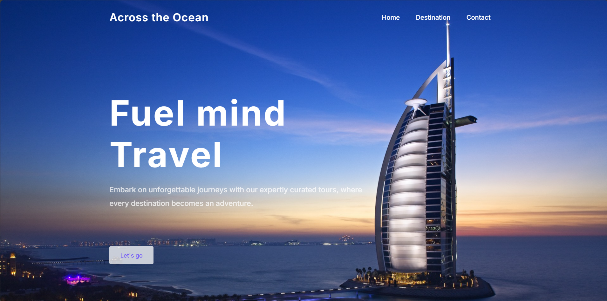
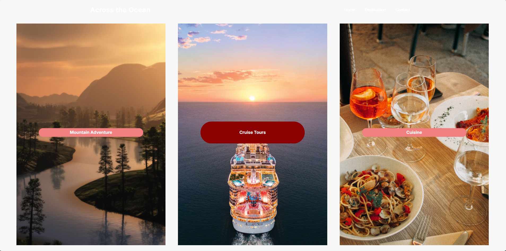
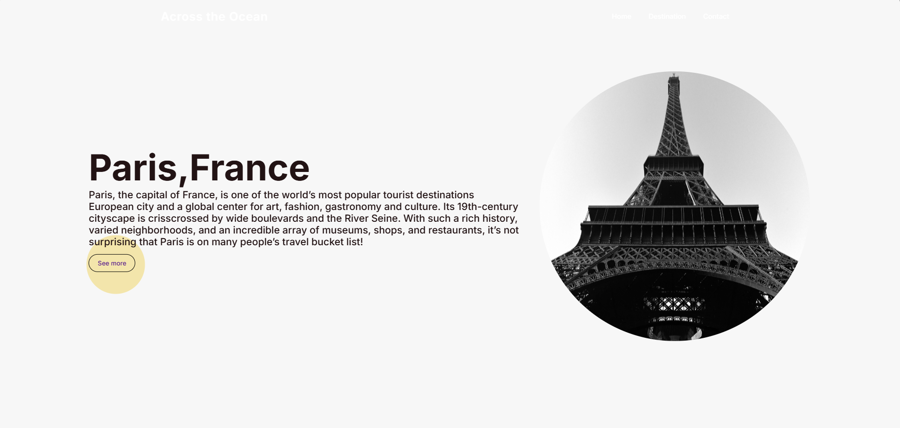
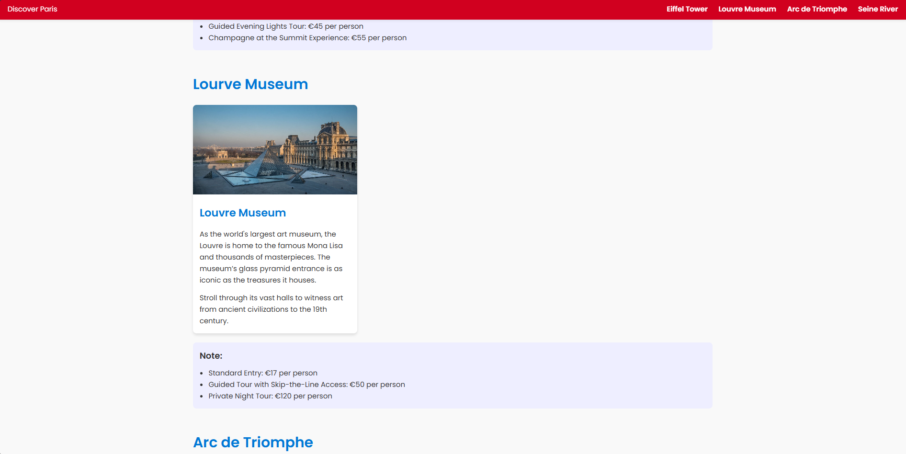
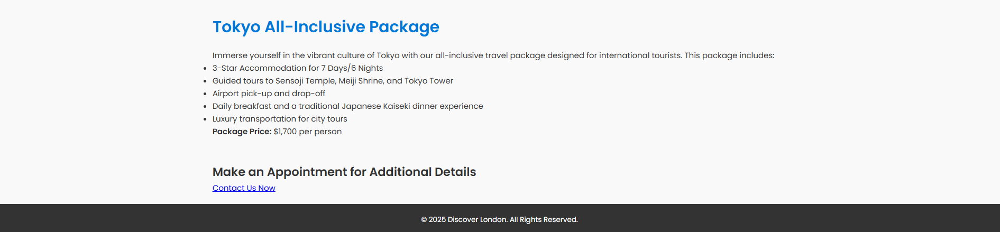
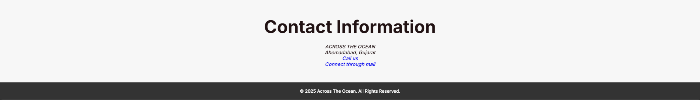

# Across The Ocean

### Overview
**Across The Ocean** is a visually engaging and interactive web project designed to inspire wanderlust and showcase amazing travel destinations across the globe. This project serves as a travel exploration hub with highlights of popular destinations, including breathtaking imagery, captivating descriptions, and user-friendly navigation.

### Features
- **Home Page**: A welcoming interface that encourages users to fuel their minds and embark on adventures.
- **Destination Highlights**: Beautifully curated sections showcasing destinations like London, Paris, and Tokyo.
- **Interactive Design**: 
  - Smooth scrolling effects using Locomotive Scroll.
  - Dynamic animations implemented with GSAP.
- **Responsive Navigation**: A clean and functional menu for seamless exploration.
- **Contact Section**: Includes detailed contact information for reaching out.
- **Engaging Media**: Features vibrant images and marquee animations for added visual appeal.

### Technologies Used
- **HTML5**: For structuring the webpage.
- **CSS3**: Styling and layout.
- **JavaScript**: Adding interactivity and smooth animations.
- **GSAP**: For advanced animations.
- **Locomotive Scroll**: Implementing smooth scrolling effects.
- **Google Fonts**: Aesthetic typography using the Inter font family.

### Screenshots
Below are some glimpses of the project:

#### Home Section
Here is the welcoming home section of the website:



Here are the services offered:



#### Destination Highlights
This section highlights the destinations featured on the website:



Know more about your travel destinations:



Information about travel packages:



#### Contact Section
The contact section helps users connect with the team:



### How to Run Locally
1. Clone the repository:
   ```bash
   git clone https://github.com/your-username/Across-The-Ocean.git
   ```
2. Navigate to the project directory:
   ```bash
   cd Across-The-Ocean
   ```
3. Open the `index.html` file in your preferred web browser.

### Project Structure
- `index.html`: Main HTML file for the website.
- `style2.css`: Styling file containing all CSS.
- `script1.js`: JavaScript file for animations and interactivity.
- `home_images/`: Directory containing images for destinations and backgrounds.

### License
This project is licensed under the MIT License. Feel free to use, modify, and distribute this project.

### Contact
- **Developer**: Across The Ocean Team
- **Email**: acrosstheocean55@gmail.com
- **Location**: Ahmedabad, Gujarat

